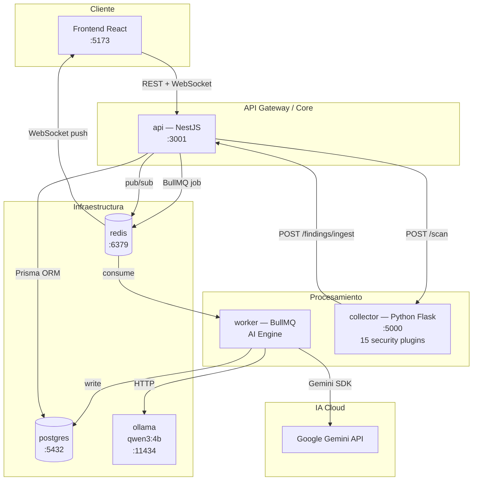
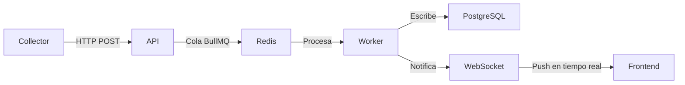

# Arquitectura de Microservicios — CEM MVP v2

## Resumen

CEM MVP v2 sigue un patrón de **microservicios desacoplados** orquestados con Docker Compose. Cada servicio tiene una única responsabilidad y se comunica con los demás a través de contratos bien definidos (HTTP/REST, WebSockets, colas BullMQ).

## Diagrama General de Microservicios

## Responsabilidades por Servicio

### `api` — NestJS 10 (puerto 3001)
- Expone REST API (`/api/v1/...`) y Swagger UI (`/api/docs`)
- WebSocket Gateway (Socket.IO) con rooms por organización
- Orquesta scans: recibe petición del frontend → llama al Collector → crea `ScanJob` en DB
- Publica jobs a colas BullMQ en Redis
- Motor de alertas (`AlertEngine`)

### `worker` — NestJS BullMQ (proceso background)
- Consume colas: `findings-ingest`, `findings-ai`, `scan-reports-ai`
- Normalización de outputs RAW de herramientas (Nmap XML, Nuclei JSONL, etc.)
- Análisis IA de hallazgos con circuit breaker (Gemini → fallback Ollama)
- Generación de reportes ejecutivos IA
- Notificaciones por email (Nodemailer)

### `collector` — Python 3 + Flask (puerto 5000)
- Plugin engine con 15 herramientas de seguridad ofensiva
- Recibe petición de scan → ejecuta plugins configurados → envía findings al API
- Modo servidor HTTP (`--server`): acepta trabajos del backend
- Endpoints: `POST /scan`, `GET /health`, `GET /plugins`

### `web` — React 18 + Vite (puerto 5173 dev / 80 prod)
- SPA con dashboard en tiempo real vía WebSocket
- Vistas: Dashboard, Findings, Assets, Domains, Reports, AI Panel, Alerts, Config
- Estado global con Zustand (`store.ts`)

### `postgres` — PostgreSQL 16 (puerto 5432)
- Modelos: `Organization`, `Asset`, `Finding`, `AiAnalysis`, `MonitoredDomain`, `ScanSession`, `ScanJob`

### `redis` — Redis 7 (puerto 6379)
- Cola de mensajes BullMQ entre `api` y `worker`
- Pub/sub para eventos WebSocket en tiempo real

### `ollama` — Ollama (puerto 11434)
- Inferencia IA local, modelo `qwen3:4b` (~2.7 GB)
- Fallback automático cuando Gemini no está disponible

---

## 1. Modelo de Datos y Hallazgos

El núcleo de la inteligencia del sistema reside en el `ReportsService.ts`. La lógica de generación de informes sigue un proceso de **Enriquecimiento y Diferenciación**.

### Clasificación de hallazgos (Ciclo de vida)
Cuando se procesa un reporte, los hallazgos se filtran de la siguiente manera:

*   **Hallazgos del escaneo actual:** Aquellos cuyo `scanId` coincide con el proceso en curso.
*   **Hallazgos nuevos:** Donde `firstScanId === currentScanId` (aparecen por primera vez).
*   **Hallazgos recurrentes:** Donde `firstScanId !== currentScanId` pero fueron reconfirmados en el escaneo actual.
*   **Hallazgos obsoletos:** En estado `OPEN` en la base de datos pero que **no** aparecieron en este escaneo.

## 3. Cálculo de Riesgo (Risk Scoring)

El sistema utiliza el `exposureScore` del activo (`Asset`) para determinar la postura de seguridad.

**Fórmula del Delta:**
`Delta = RiskScore_Actual - RiskScore_Anterior`

*   **Delta > 0:** La superficie de exposición ha empeorado (nuevas vulnerabilidades o criticidad aumentada).
*   **Delta < 0:** Se han mitigado riesgos o cerrado vulnerabilidades.

## 4. Estrategia de Ingesta Asíncrona

Para evitar timeouts en el collector (especialmente con salidas grandes como Nmap XML), la API implementa un patrón de **"Recibir y olvidar"** (*fire-and-forget*):

1.  El Collector envía un `POST /api/v1/collectors/upload/:tool`.
2.  La API valida el `x-collector-id` y el tamaño del cuerpo.
3.  La API encola un trabajo en **BullMQ**.
4.  La API responde inmediatamente con `201 Created` al collector.
5.  El Worker procesa el archivo crudo en segundo plano.

## 5. Comunicación en Tiempo Real (WebSockets)

Se utiliza **Socket.IO** con una estrategia de **Rooms** (salas por organización).

*   **Suscripción:** Al iniciar el dashboard, el cliente emite `join:org { orgId }`.
*   **Emisión:** El `TelemetryService` publica eventos (ej: `scan:progress`, `scan:report_ready`). El Gateway de NestJS escucha esos eventos y ejecuta `server.to(room).emit(type, data)`.

## 6. Pipeline de IA

El sistema utiliza un enfoque de **Modelos Híbridos (nube/local)** con una estrategia de **Resiliencia (Disyuntor / Circuit Breaker)**. Se divide en dos capacidades principales:

### A. Generación de Informes y Análisis
*   **Disparo:** Automático tras scan o manual.
*   **Contexto:** Se recuperan los 20 hallazgos más críticos del activo.

### B. Chat Asistente de Seguridad (AI Chat)
Integrado en el `AI Panel`, permite al usuario realizar consultas en lenguaje natural sobre el estado de la infraestructura.
*   **RAG (Retrieval-Augmented Generation) simplificado:** El sistema inyecta el estado actual de los activos y hallazgos críticos en el prompt del sistema para que la IA responda con contexto real.
*   **Memoria:** Mantiene el hilo de conversación por sesión de usuario.

**Mecanismo de Resiliencia:** Si la API de Gemini falla 3 veces consecutivas, el worker abre el circuito durante 5 minutos y redirige automáticamente todas las peticiones a Ollama (local).

## 7. Seguridad y Autenticación

El sistema implementa seguridad multicapa:
- **RBAC:** Control de acceso basado en roles (Admin, Auditor, Viewer).
- **2FA (Two-Factor Auth):** 
    1. El usuario habilita 2FA en `ConfigView` confirmando su contraseña.
    2. En el login, tras validar credenciales, se genera un código de 6 dígitos.
    3. Se envía vía SMTP (Nodemailer) al correo del usuario.
    4. El token expira en 10 minutos.
- **Aislamiento Multitenant:** Los datos están filtrados estrictamente por `orgId` a nivel de base de datos y canales de WebSocket.

## 8. Sistema de Notificaciones
El motor de alertas (`AlertEngine`) procesa hallazgos en tiempo real:
*   **Reglas:** Los usuarios definen filtros (ej. "Severidad >= HIGH").
*   **Canales:** Soporte para Email (SMTP) y Webhooks (Slack/Teams).
*   **Historial:** Auditoría completa de todas las notificaciones enviadas desde el panel de configuración.

## 9. Motores de Ingesta (Collectors)

Existen dos métodos de recolección soportados:
*   **Collector Dinámico (Python):** Motor basado en plugins que descubre herramientas en `/plugins` y envía hallazgos normalizados uno a uno al API.
*   **Orquestador Kali (Bash):** Script `full-scan.sh` optimizado para entornos Kali Linux que ejecuta herramientas nativas y envía las salidas crudas al API para su procesamiento en el servidor.

## 7. Documentación de la API

La API utiliza **Swagger (OpenAPI 3.0)** para la documentación interactiva y el contrato de datos.
*   Los DTOs se mapean automáticamente mediante el plugin de compilación de NestJS.
*   La interfaz interactiva permite probar los endpoints directamente desde el navegador.
*   **Acceso local:** `http://localhost:3001/api/docs`
*   **Formato de respuesta:** JSON estandarizado.

## 8. Diagrama de Flujo Completo
