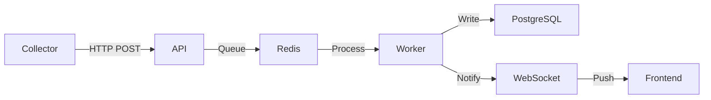

# Especificación Técnica de Arquitectura

## 1. Modelo de Datos y Hallazgos

El núcleo de la inteligencia del sistema reside en el `ReportsService.ts`. La lógica de generación de informes sigue un proceso de **Enriquecimiento y Diferenciación**.

### Clasificación de hallazgos (Finding Lifecycle)
Cuando se procesa un reporte, los hallazgos se filtran de la siguiente manera:

*   **This Scan Findings:** Hallazgos cuyo `scanId` coincide con el proceso actual.
*   **New Findings:** Hallazgos donde `firstScanId === currentScanId`.
*   **Recurring Findings:** Hallazgos donde `firstScanId !== currentScanId` pero fueron re-confirmados hoy.
*   **Stale Findings:** Hallazgos en estado `OPEN` en la DB pero que **no** aparecieron en este escaneo.

## 2. Cálculo de Riesgo (Risk Scoring)

El sistema utiliza el `exposureScore` del activo (`Asset`) para determinar la postura de seguridad.

**Fórmula del Delta:**
`Delta = RiskScore_Actual - RiskScore_Anterior`

*   **Delta > 0:** La superficie de exposición ha empeorado (nuevas vulnerabilidades o criticidad aumentada).
*   **Delta < 0:** Se han mitigado riesgos o cerrado vulnerabilidades.

## 3. Estrategia de Ingesta Asíncrona

Para evitar timeouts en el collector (especialmente con outputs grandes como Nmap XML), la API implementa un patrón de **"Ingest-and-Forget"**:

1.  El Collector hace un `POST /api/v1/collectors/upload/:tool`.
2.  La API valida el `x-collector-id` y el tamaño del body.
3.  La API envía un JOB a **BullMQ**.
4.  La API retorna inmediatamente un `201 Created` al collector.
5.  El Worker procesa el archivo RAW en segundo plano.

## 4. Comunicación Real-time (WebSockets)

Se utiliza **Socket.IO** con una estrategia de **Rooms**.

*   **Suscripción:** Al iniciar el dashboard, el cliente emite `join:org { orgId }`.
*   **Emisión:** El `TelemetryService` publica eventos en Redis. El Gateway de NestJS escucha estos eventos y hace un `server.to(room).emit('scan:report_ready', data)`.

## 5. Pipeline de IA

El flujo de generación de informes ejecutivos es:

1.  **Trigger:** El usuario solicita un informe IA.
2.  **Context Building:** El Worker recupera los TOP 20 hallazgos más críticos del scan.
3.  **Prompt Engineering:** Se envía a Gemini/Ollama un prompt estructurado que incluye:
    - Metadatos del activo (dominio, IP).
    - Estadísticas (Nuevos vs Recurrentes).
    - Detalles técnicos de los hallazgos.
4.  **Fallback:** Si Gemini falla (API limit), el sistema intenta usar Ollama localmente.

## 6. Diagrama de Flujo

